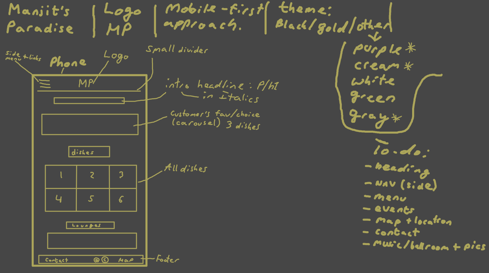

# Description and Goals

A restaurant landing site with a focus on some of my favorite dishes, and extra recreational and relaxing venues.

The reason I made this is because I wanted to push my design and creative abilities a bit further to create a modern and responsive site, which I would then use to hopefully secure an interview with a potential employer.

One of my goals was to also make the site easy to use and navigate, for example, clicking on an email would open an email client, or clicking the phone number would bring up the phone interface.

# Deployed Site

https://mrmaciejm.github.io/restaurant-site/

# Bonus - Early Wireframe

I have used Krita, a digital drawing and animation software, to plan out the early version of my restaurant site; the original focus was to design it with mobile-first approach, before expanding it to laptop and desktop sizes.

